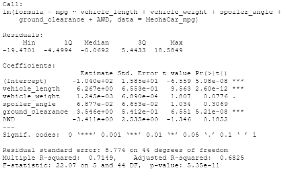
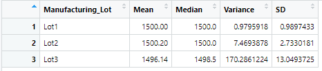
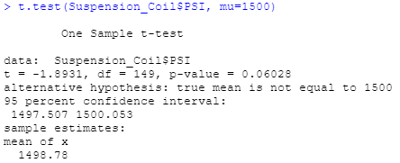
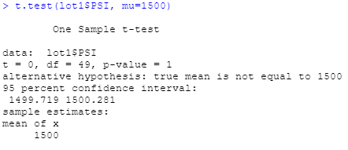
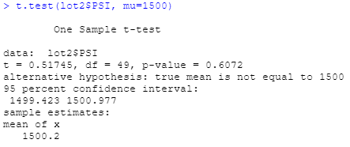
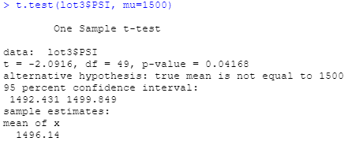

# MechaCar Statistical Analysis
## Linear Regression to Predict MPG

### Model:
#### mpg = 6.267(vehicle_length) + 0.001245(vehicle_weight) + 0.06877(spoiler_angle) + 3.546(ground_clearnce) + -3.411(AWD) - 104.0
### Summary:
From performing linear regression on the MechaCar_mpg.csv, we can draw conclusions:
1. Vehicle length and ground clearance have a non-random amount of variance to the mpg values. Therefore, the vehicle length and ground clearance have a significant impact on the mpg. Whereas, vehicle weight, spoiler angle, and AWD have a random amout of variance to the mpg values because their p-values are higher
2. We know from our results above that our p-value for this model is 5.35e-11. The p-value is significantly smaller than the significance level of 0.05%. This means we can reject our null hypotheses, therefore, meaning that the slope of the linear model is not 0.
3.  We know our R-squared value is 0.7149 which is close to the value 1. This means the data has a strong correlation and can predict the model effectively.
## Summary Statistics on Suspension

### Summary:
From design specifications we know that the variance of the suspension coils cannot be higher than 100 pounds per square inch. From our tables above, we can see that both Lot 1 and Lot 2's variances are lower than 100 pounds per square inch (0.980 and 7.47 respectively). Lot 3's variance is higher than 100 pounds per square inch. The variance is 170.286 pounds per square inch. Therefore, the current data for Lot 3 does not meet the design specification individually. However, the total variance (all lots together) is 62.29 pounds per square inch which is lower than 100. The current data for all manufacturing lots in total does meet the the design specification.
## T-Tests on Suspension Coils
### T-Test across all manufacturing lots
\
We can see above that the mean of PSI is 1498.78 and the p-value is 0.06028. The p-value is higher than the significance level of 0.05, therefore, we can fail to reject the null hypothesis. This means that there is no significant difference between the sample mean and the true mean of 1500.
### T-Tests for each manufacturing lots
1. Lot 1: We can see that the mean is 1500 and the p-value is 1. The p-value is clearly higher than the significance level of 0.05, therefore, we can fail to reject the null hypotheses. This means there is no significant difference between the sample mean and the true mean of 1500 for Lot 1.
2. Lot 2: We can see that the mean is 1500.2 and the p-value is 0.6072. The p-value is clearly higher than the significance level of 0.05, therefore, we can fail to reject the null hypotheses. This means there is no significant difference between the sample mean and the true mean of 1500 for Lot 2.
3. Lot 3: We can see that the mean is 14.96.14 and the p-value is 0.04168. The p-value is lower than the significance level of 0.05, therefore, we reject the null hypotheses. This means there is a difference between the sample mean and the true mean of 1500 for Lot 3. 
4. Lot 3 is the only one where we had to reject the null hypothesis. This means something is going on with Lot 3's production. The production needs to be reviewed to figure out why it is not meeting quality criteria.\
\
\

## Study Design: MechaCar vs Competition
### Metrics
Collect data for 2 years from similar models across different manufacturing companies using the following metrics:
* Selling Price: Dependent Variable
* MPG: Independent Variable
* Maintenance Cost (per year): Independent Variable
* Safety Rating: Independent Variable
* AWD: Independent Variable
* Packages: Independent Variable
### Hypothesis
* Null Hypothesis: The MechaCar is priced accurately based on the key factors (metrics).
* Alternative Hypothesis: The MechaCar is not priced accurately based on the key factors.
### Test
I would use a Multi Linear Regression test as we have multiple independent variables and are trying to predict if the independent variables are factors in determining the dependent variable.
### Data 
We need to collect data for each metric for each similar model across different manufacturing companies.
